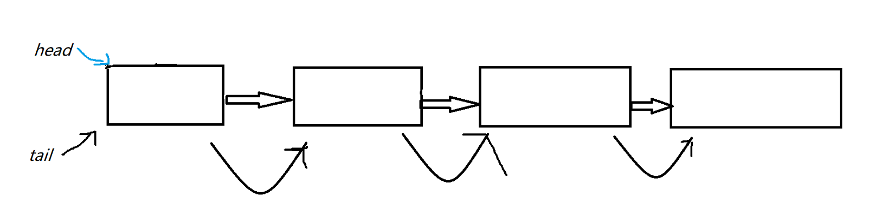
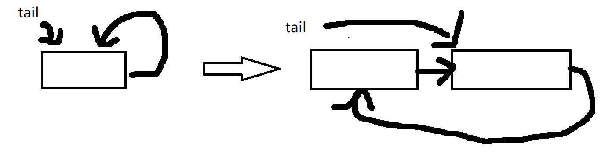

# 链表

### ---在这个文件中我将书上的所有属于链表的示例都在这里实现了一遍  
#### Pycharm中按shift+tap就可以代码整体左移

--------

在实现基于链表的队列和栈时，_Node类中的属性忘记加上`self`
了，导致建出来的节点的属性很奇怪，既不是None也不是别的，而是这样的报错:

`AttributeError: '_Node' object has no attribute '_element'`,

而调试中的属性值是这样的：<br>

`'Traceback (most recent call last):
File "D:\\Python_Project\\PyCharm Community Edition 2022.1\\plugins\\python-ce\\helpers\\pydev\\_pydevd_bundle\\pydevd_resolver.py", line 178, in _getPyDictionary
attr = getattr(var, n)
^^^^^^^^^^^^^^^
AttributeE'`<br>

--------------------------------------------------------------------

看看就好。。。
总而言之，如果是属性一定要加 ***self*** ，不然会出错

队列那里的实现图：


循环链表的实现图：

只能说尾指针永远是你尾指针，尾指针对比头指针的好处在于：
`可以更方便得添加和（删减？？？）链表，如果是队列的话删减链表就很方便，而头指针则一定要遍历所有链表，慢很多`
<br>

--------------------------------------------------------------------------

&emsp;&ensp; 这次的发现是私有变量的问题.<br>
>如果类中的`__init__`中定义了私有变量，但 你的`__slots__`变量中记录的不和`__init__`中的一致,那不管你用都是报错，他会告诉你根本没这个变量 
而且```print(dir("类A”))```会输出`__slots__`中记录的


下面是错误例子：  

***都是只测试了`self._(_)next`!!!***
1.
```doctest
class _Node:
    __slots__ = '_element', '_next'

    def __init__(self, e, next=None):
        self._element = e
        self.__next = next

print(dir(_Node)) #['__class__', '__delattr__', '__dir__', '__doc__', '__eq__', '__format__', '__ge__', '__getattribute__', '__getstate__', '__gt__', '__hash__', '__init__', '__init_subclass__', '__le__', '__lt__', '__module__', '__ne__', '__new__', '__reduce__', '__reduce_ex__', '__repr__', '__setattr__', '__sizeof__', '__slots__', '__str__', '__subclasshook__', '_element', '_next']
```
2. 
```doctest

class _Node:
    __slots__ = '_element', '__next'

    def __init__(self, e, next=None):
        self._element = e
        self._next = next #['_Node__next', '__class__', '__delattr__', '__dir__', '__doc__', '__eq__', '__format__', '__ge__', '__getattribute__', '__getstate__', '__gt__', '__hash__', '__init__', '__init_subclass__', '__le__', '__lt__', '__module__', '__ne__', '__new__', '__reduce__', '__reduce_ex__', '__repr__', '__setattr__', '__sizeof__', '__slots__', '__str__', '__subclasshook__', '_element']
```
正确示范：  

***都是只测试了`self._(_)next`!!!***
1.
```doctest
class _Node:
    __slots__ = '_element', '_next'

    def __init__(self, e, next=None):
        self._element = e
        self._next = next #['__class__', '__delattr__', '__dir__', '__doc__', '__eq__', '__format__', '__ge__', '__getattribute__', '__getstate__', '__gt__', '__hash__', '__init__', '__init_subclass__', '__le__', '__lt__', '__module__', '__ne__', '__new__', '__reduce__', '__reduce_ex__', '__repr__', '__setattr__', '__sizeof__', '__slots__', '__str__', '__subclasshook__', '_element', '_next']
```
2.
```doctest
class _Node:
    __slots__ = '_element', '__next'

    def __init__(self, e, next=None):
        self._element = e
        self.__next = next #['_Node__next', '__class__', '__delattr__', '__dir__', '__doc__', '__eq__', '__format__', '__ge__', '__getattribute__', '__getstate__', '__gt__', '__hash__', '__init__', '__init_subclass__', '__le__', '__lt__', '__module__', '__ne__', '__new__', '__reduce__', '__reduce_ex__', '__repr__', '__setattr__', '__sizeof__', '__slots__', '__str__', '__subclasshook__', '_element']
```